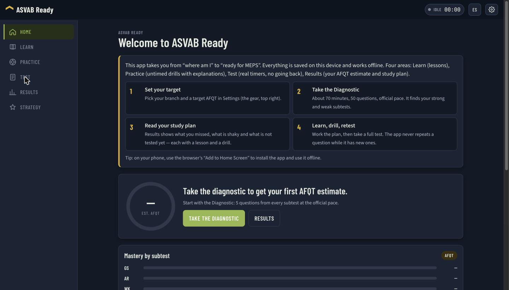
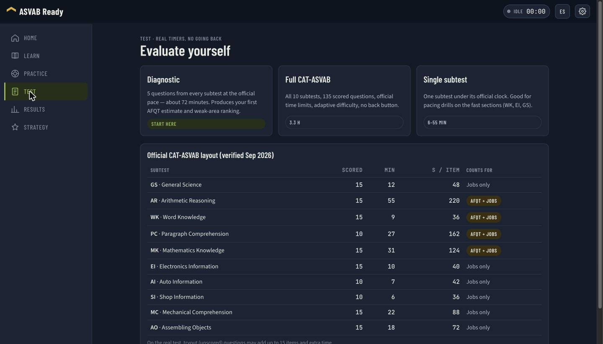
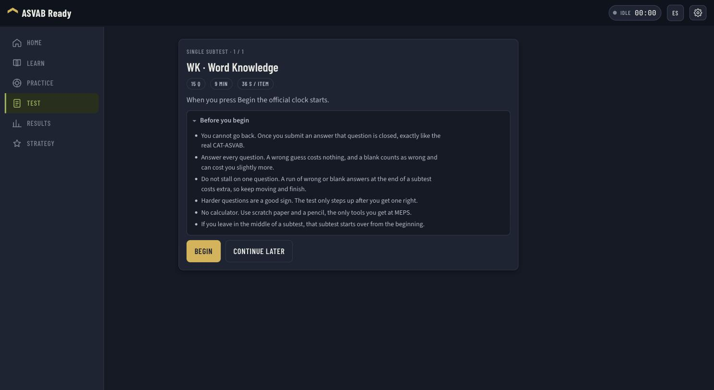
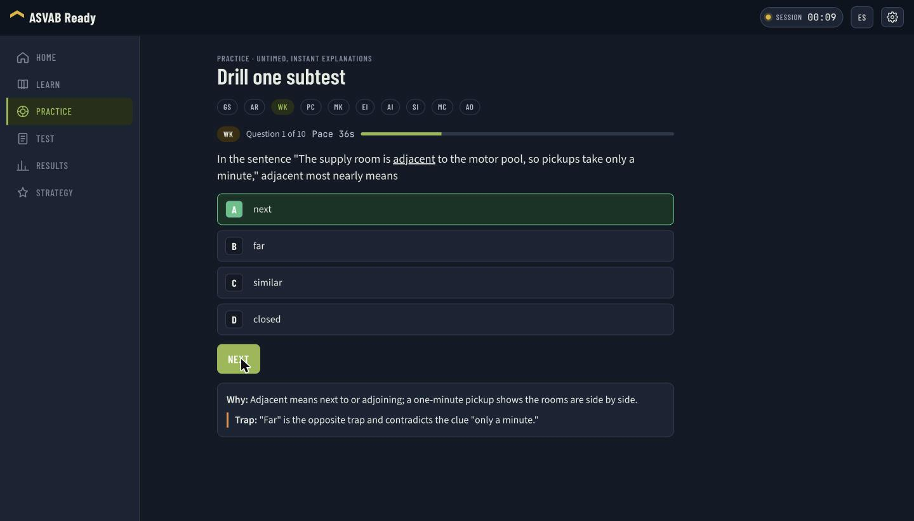
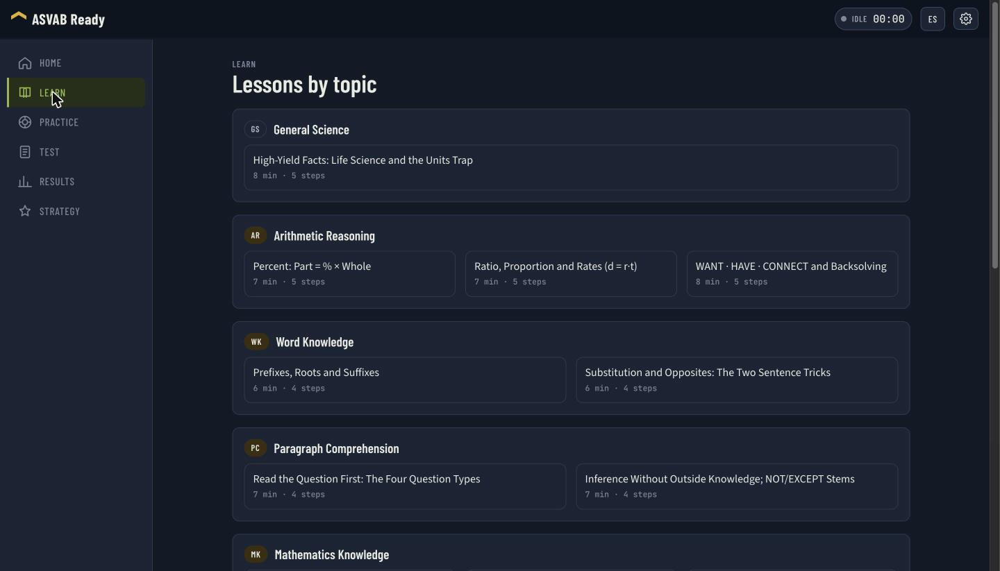

# ASVAB Ready

Offline-capable PWA to learn, practice and evaluate yourself for the ASVAB - real subtest timers, adaptive test simulation, AFQT/line-score simulator, English + Spanish.

## Screens


The Home dashboard: a first-run walkthrough, the estimated AFQT gauge and mastery by subtest. Everything is stored on the device and works offline.


Three test modes (Diagnostic, Full CAT-ASVAB, single subtest) above the official CAT-ASVAB layout, verified against officialasvab.com and kept in one source of truth.


Every timed subtest opens with its item count, clock and pace, plus the CAT rules a student needs before the timer starts.


Practice is untimed and explains every item: why the right answer is right, and which trap the wrong ones are built on.


Lessons grouped by subtest, each one step-by-step and available in English and Spanish.

## Run it

```bash
npm install
npm run dev        # http://localhost:5173
npm test           # unit tests (vitest)
npm run build      # typecheck + production build -> dist/ (includes service worker)
npm run preview    # serve dist/ locally to test the PWA install prompt
```

Deploy `dist/` to any static host (GitHub Pages, Netlify, Cloudflare Pages, Vercel). No backend.

## Layout

```
src/
  domain/      pure TypeScript, no DOM - fully unit-tested
    config/    subtests.ts - the official CAT-ASVAB table (single source of truth)
    questions/ Question types, QuestionBank (filter/sample/pick), JSON source
    session/   SessionEngine + strategies (AdaptiveStrategy = CAT rules, LinearStrategy = practice)
    timing/    Clock (injectable), Timer (stopwatch/countdown), PaceBudget (per-item budget)
    scoring/   Scorer - standard scores -> VE -> AFQT percentile -> category -> line scores (formulas in data/scoring.json)
    analysis/  DiagnosticAnalyzer (weak areas by gap x AFQT leverage) · StudyPlanBuilder (per-subtest/per-topic plan)
    test/      TestPlan (diagnostic / full / single) · TestRunner (sequential subtests, resumable)
    topics/    Topics - taxonomy of what each subtest covers (data/topics.json)
    lessons/   LessonLibrary (data/lessons.json) · strategy/ Strategies (data/strategies.json)
    storage/   Progress model, ProgressStore port, IndexedDbStore, BackupService (export/import/merge), ProgressService
    i18n/      I18n + en.json / es.json
  ui/          framework-light views: AppShell (nav + timer chip), screens/ (Home, Learn, Practice, Test, Results, Strategy), components/QuestionPlayer
  data/        questions/<subtest>.json (730 items) · topics.json · lessons.json · strategies.json · scoring.json
  main.ts      composition root - the only file that knows concrete implementations
tests/         vitest suites for every domain module
docs/          STATUS.md (tracker) · PLAN.md · screenshots/ · research/ (brief, strategies, sources & licensing)
```

## Principles

- SOLID in the domain: each module has one reason to change; strategies and stores are swappable behind interfaces; views depend on small ports (`QuestionSource`, `ProgressStore`, `Clock`); `main.ts` does all wiring.
- KISS at the edges: no framework, no DI container, no state library. `h()` builds DOM, screens re-render.
- Content policy: every question, distractor and explanation is original. Embedded text only from public-domain / CC BY / CC BY-SA sources. See `docs/research/02_SOURCES_AND_LICENSING.md`.

## Adding content

Add items to `src/data/questions/<code>.json` following the schema in `src/domain/questions/types.ts` (4 choices, `difficulty` 1-3, `stem`/`choices`/`explanation` in `en` and `es`). Spanish items use the same number format as their English twin: a point for decimals, a comma for thousands. Invalid items are skipped at load time (see `validateQuestion`).

## Milestones

M0 mock ✓ · M1 scaffold + domain ✓ · M2 domain tests ✓ · M3 Practice + Learn ✓ · M4 Diagnostic + Full CAT + resume ✓ · M5 Results + Strategy ✓ · M6 content (730 original items, topic taxonomy, AO generator, study plan) ✓ · M7 PWA polish (icons, install prompt, phone QA) · M8 planner + spaced repetition + recovery-code sync

## Content tools

```bash
node scripts/validate-questions.mjs        # schema, answer spread and EN/ES number format for every bank
node scripts/generate-ao.mjs 40 20260903   # regenerate Assembling Objects items (count, seed)
```
